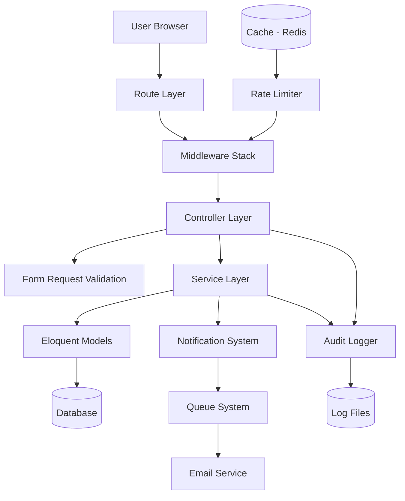
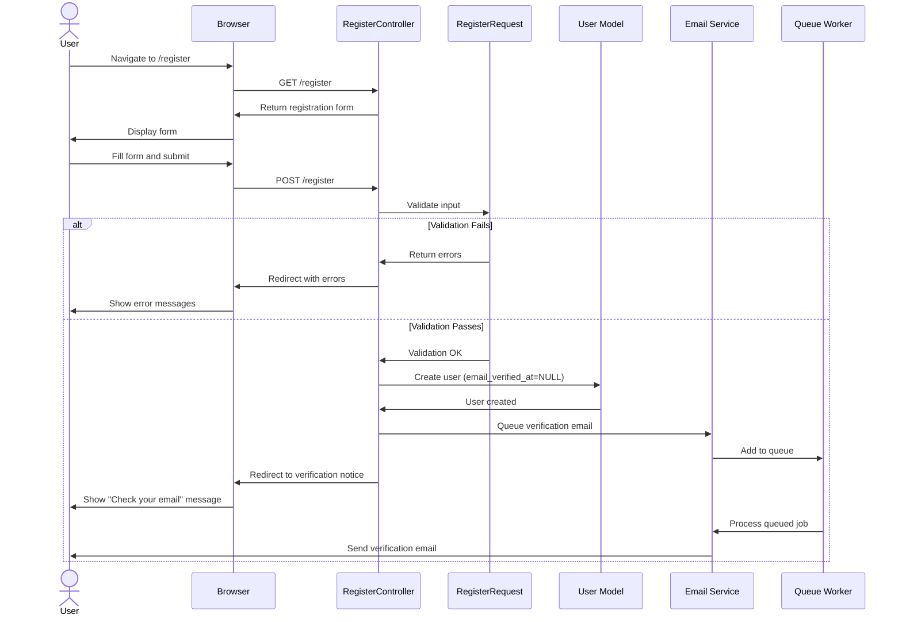
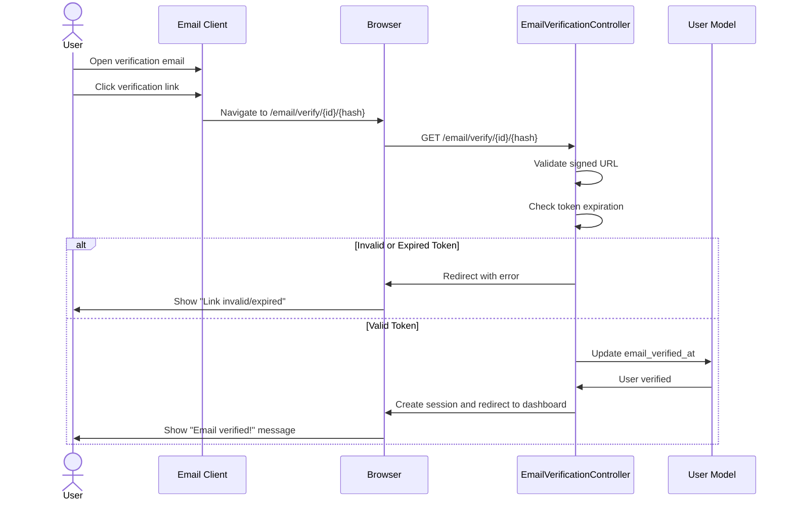
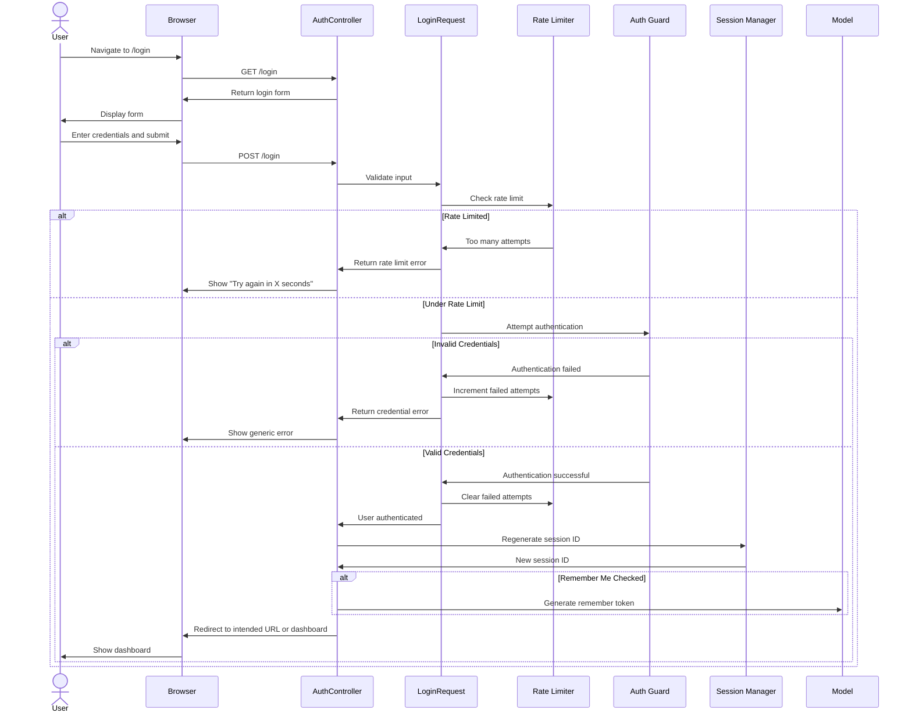
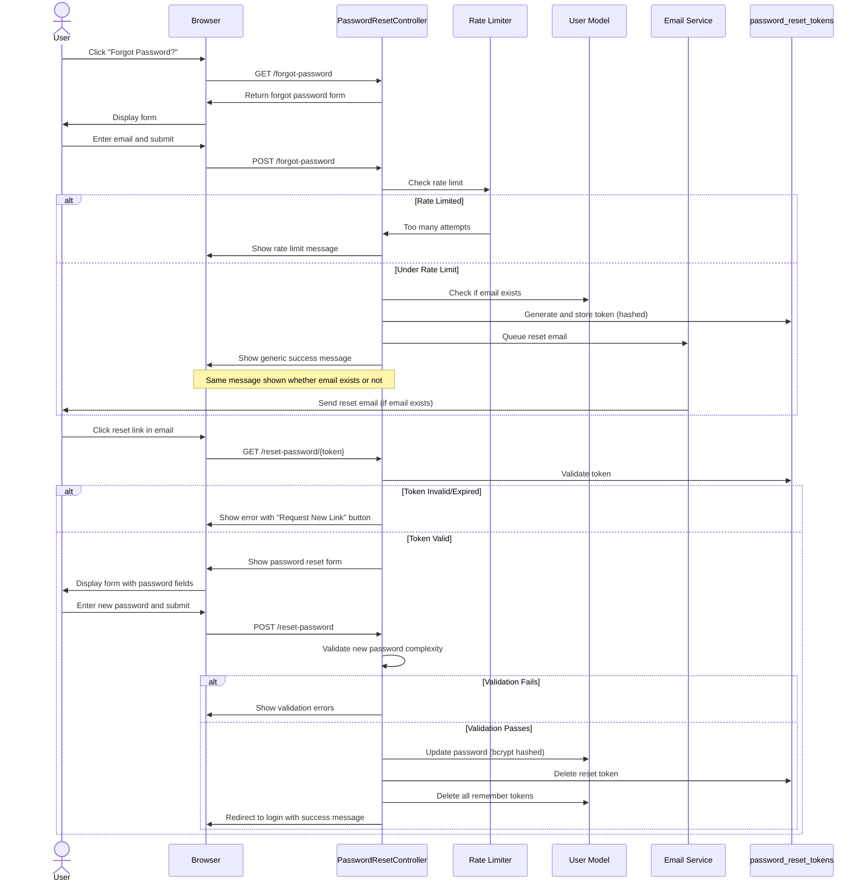
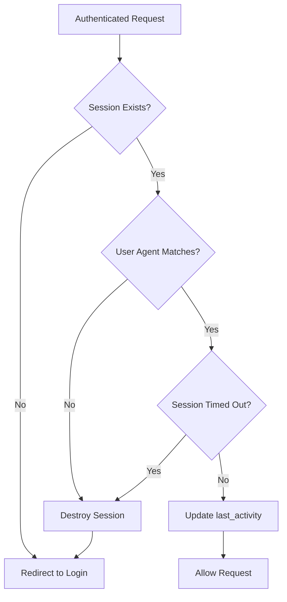

# Technical Design Document: Professional Authentication System

## Overview

This document outlines the technical design for a comprehensive, professional-grade authentication system for the Laravel visitor management application. The system implements user registration, email verification, secure login/logout, password reset, session management, rate limiting, and audit logging following Laravel best practices and industry security standards.

### Design Goals

- **Security First**: Implement defense-in-depth with rate limiting, CSRF protection, secure session handling, and comprehensive audit logging
- **Laravel Native**: Leverage Laravel's built-in authentication features and conventions
- **User Experience**: Provide clear feedback, responsive design, and accessibility compliance
- **Maintainability**: Follow SOLID principles, use Form Requests for validation, and maintain clear separation of concerns
- **Performance**: Optimize database queries, use caching for rate limiting, and ensure sub-second response times

### Technology Stack

- **Framework**: Laravel 11.x
- **Database**: MySQL/PostgreSQL (via Laravel migrations)
- **Session Storage**: Database driver (configured)
- **Cache**: Redis/Memcached for rate limiting
- **Email**: Laravel Mail with queued notifications
- **Frontend**: Blade templates with responsive CSS framework

---

## Architecture

### High-Level Architecture



### Component Architecture

The system follows a layered architecture:

1. **Presentation Layer**: Blade views with responsive HTML/CSS
2. **Route Layer**: Web routes with middleware protection
3. **Middleware Layer**: Authentication, CSRF, rate limiting, session validation
4. **Controller Layer**: Thin controllers orchestrating business logic
5. **Validation Layer**: Form Request classes with custom rules
6. **Service Layer**: Business logic for authentication operations
7. **Model Layer**: Eloquent models with relationships
8. **Infrastructure Layer**: Notifications, logging, caching

### Key Design Patterns

- **Repository Pattern** (via Eloquent): Data access abstraction
- **Service Pattern**: Encapsulate complex business logic
- **Observer Pattern**: Laravel events for audit logging
- **Factory Pattern**: User and token generation for testing
- **Strategy Pattern**: Multiple authentication guards (web, api)

---

## Correctness Properties

_Note: This authentication system is primarily infrastructure code with side effects (database operations, email sending, session management). Traditional property-based testing with universal quantification is not applicable. Instead, correctness is validated through integration tests covering specific authentication scenarios and security requirements._

### Security Invariants

The following security invariants must hold across all authentication operations:

1. **Password Security**: _For any_ user registration or password change, the password SHALL be hashed using bcrypt with cost factor 12 before storage
2. **Session Integrity**: _For any_ authenticated request, the session SHALL be validated against the database record matching user agent and IP address
3. **Rate Limiting**: _For any_ authentication endpoint (login, password reset, email verification), requests SHALL be rate-limited according to the defined thresholds (5 login attempts per 60 seconds, 3 password reset requests per 60 minutes)
4. **Token Expiration**: _For any_ email verification or password reset token, the token SHALL expire after the defined time window (24 hours for email verification, 60 minutes for password reset)
5. **CSRF Protection**: _For any_ state-changing request, a valid CSRF token SHALL be required

### Authentication Flow Properties

1. **Email Uniqueness**: _For any_ registration attempt, the email address SHALL be unique across all users
2. **Email Verification Required**: _For any_ access to protected routes, the user's email SHALL be verified (email_verified_at is not null)
3. **Session Regeneration**: _For any_ successful login, the session ID SHALL be regenerated to prevent session fixation
4. **Credential Validation**: _For any_ login attempt, credentials SHALL be validated and rate limiting SHALL be applied before authentication

### Testing Strategy

Since this is infrastructure code with external dependencies (database, cache, email service), correctness is validated through:

- **Integration Tests**: Test complete authentication flows (registration → email verification → login → logout)
- **Unit Tests**: Test validation rules (password complexity, email format)
- **Security Tests**: Test rate limiting, token expiration, CSRF protection
- **Snapshot Tests**: Test email template rendering

---

## Data Models

### Users Table (Existing + Modifications)

The existing `users` table already has the necessary fields for authentication:

```sql
CREATE TABLE users (
    id BIGINT UNSIGNED AUTO_INCREMENT PRIMARY KEY,
    name VARCHAR(255) NOT NULL,
    email VARCHAR(255) UNIQUE NOT NULL,
    email_verified_at TIMESTAMP NULL,
    password VARCHAR(255) NOT NULL,
    remember_token VARCHAR(100) NULL,
    role VARCHAR(50) DEFAULT 'user',
    created_at TIMESTAMP NULL,
    updated_at TIMESTAMP NULL,
    INDEX idx_email (email),
    INDEX idx_email_verified (email_verified_at)
);
```

**Fields:**

- `id`: Primary key
- `name`: User's full name (2-255 characters)
- `email`: Unique email address (stored lowercase)
- `email_verified_at`: Timestamp when email was verified (NULL = unverified)
- `password`: Bcrypt hashed password (cost factor 12)
- `remember_token`: Token for "Remember Me" functionality
- `role`: User role (admin, user, etc.)
- `created_at`, `updated_at`: Timestamps

### Password Reset Tokens Table (Existing)

The existing `password_reset_tokens` table is already configured:

```sql
CREATE TABLE password_reset_tokens (
    email VARCHAR(255) PRIMARY KEY,
    token VARCHAR(255) NOT NULL,
    created_at TIMESTAMP NULL,
    INDEX idx_created_at (created_at)
);
```

**Fields:**

- `email`: Primary key - user's email address
- `token`: Hashed reset token
- `created_at`: Token creation timestamp (for expiration checking)

**Token Lifecycle:**

- Generated on password reset request
- Expires after 60 minutes (configurable in `config/auth.php`)
- Deleted after successful password reset
- Hashed before storage using SHA-256

### Sessions Table (Existing)

The existing `sessions` table supports database-driven session storage:

```sql
CREATE TABLE sessions (
    id VARCHAR(255) PRIMARY KEY,
    user_id BIGINT UNSIGNED NULL,
    ip_address VARCHAR(45) NULL,
    user_agent TEXT NULL,
    payload LONGTEXT NOT NULL,
    last_activity INT NOT NULL,
    FOREIGN KEY (user_id) REFERENCES users(id) ON DELETE CASCADE,
    INDEX idx_user_id (user_id),
    INDEX idx_last_activity (last_activity)
);
```

**Fields:**

- `id`: Session identifier (regenerated on login)
- `user_id`: Foreign key to users table (NULL for guest sessions)
- `ip_address`: Client IP address for session validation
- `user_agent`: Browser user agent for session validation
- `payload`: Serialized session data
- `last_activity`: Unix timestamp of last request (for timeout calculation)

### Cache Table (for Rate Limiting)

The existing `cache` table is used for rate limiting:

```sql
CREATE TABLE cache (
    key VARCHAR(255) PRIMARY KEY,
    value MEDIUMTEXT NOT NULL,
    expiration INT NOT NULL,
    INDEX idx_expiration (expiration)
);
```

**Rate Limiting Keys:**

- `login_attempts:{email}`: Failed login attempts counter
- `password_reset_attempts:{email}`: Password reset request counter
- `email_verification_attempts:{email}`: Email resend request counter

---

## Components and Interfaces

This section describes the key components of the authentication system and their interfaces.

### Controllers

#### 1. AuthController

**Responsibility**: Handle login and logout operations

```php
namespace App\Http\Controllers\Auth;

class AuthController extends Controller
{
    public function showLoginForm(): View
    public function login(LoginRequest $request): RedirectResponse
    public function logout(Request $request): RedirectResponse
}
```

**Methods:**

- `showLoginForm()`: Display login page (guest middleware)
- `login(LoginRequest)`: Process login attempt
    - Validate credentials via LoginRequest
    - Check rate limiting (5 attempts per 60 seconds)
    - Verify email is verified
    - Attempt authentication
    - Regenerate session ID
    - Handle "Remember Me"
    - Log successful/failed attempts
    - Redirect to intended URL or dashboard
- `logout(Request)`: Process logout
    - Invalidate session
    - Regenerate CSRF token
    - Delete remember token
    - Log logout event
    - Redirect to login page

**Dependencies:**

- `LoginRequest`: Validation
- `RateLimiter`: Brute force protection
- `Logger`: Audit logging
- `Auth` facade: Laravel authentication

#### 2. RegisterController

**Responsibility**: Handle user registration

```php
namespace App\Http\Controllers\Auth;

class RegisterController extends Controller
{
    public function showRegistrationForm(): View
    public function register(RegisterRequest $request): RedirectResponse
}
```

**Methods:**

- `showRegistrationForm()`: Display registration page (guest middleware)
- `register(RegisterRequest)`: Process registration
    - Validate input via RegisterRequest
    - Hash password with bcrypt (cost 12)
    - Store email as lowercase
    - Create user record
    - Generate verification token
    - Send verification email (queued)
    - Log registration event
    - Redirect to verification notice page

**Dependencies:**

- `RegisterRequest`: Validation with password complexity rules
- `EmailVerificationService`: Token generation and email sending
- `Logger`: Audit logging
- `Hash` facade: Password hashing

#### 3. EmailVerificationController

**Responsibility**: Handle email verification process

```php
namespace App\Http\Controllers\Auth;

class EmailVerificationController extends Controller
{
    public function notice(): View
    public function verify(Request $request, string $id, string $hash): RedirectResponse
    public function resend(Request $request): RedirectResponse
}
```

**Methods:**

- `notice()`: Display email verification notice (auth + unverified middleware)
- `verify($id, $hash)`: Process verification link
    - Validate token in URL
    - Check token expiration (24 hours)
    - Mark email as verified (email_verified_at)
    - Delete verification token
    - Create authenticated session
    - Log verification event
    - Redirect to dashboard with success message
- `resend(Request)`: Resend verification email
    - Check if already verified
    - Rate limit (3 attempts per 60 minutes)
    - Invalidate old tokens
    - Generate new token
    - Send new email (queued)
    - Log resend event
    - Display success message

**Dependencies:**

- `EmailVerificationService`: Token management
- `RateLimiter`: Resend throttling
- `Logger`: Audit logging

#### 4. PasswordResetController

**Responsibility**: Handle password reset flow

```php
namespace App\Http\Controllers\Auth;

class PasswordResetController extends Controller
{
    public function showLinkRequestForm(): View
    public function sendResetLinkEmail(ForgotPasswordRequest $request): RedirectResponse
    public function showResetForm(Request $request, string $token): View
    public function reset(ResetPasswordRequest $request): RedirectResponse
}
```

**Methods:**

- `showLinkRequestForm()`: Display "Forgot Password" form (guest middleware)
- `sendResetLinkEmail(ForgotPasswordRequest)`: Send reset link
    - Validate email
    - Rate limit (3 attempts per 60 minutes)
    - Generate secure token
    - Hash and store token (60 minute expiration)
    - Send reset email (queued)
    - Log reset request
    - Display generic success message (even if email doesn't exist)
- `showResetForm($token)`: Display password reset form
    - Validate token exists
    - Pre-populate email from token
    - Display password complexity indicator
- `reset(ResetPasswordRequest)`: Process password reset
    - Validate token and new password
    - Check token expiration
    - Hash new password (bcrypt cost 12)
    - Update user password
    - Delete reset token
    - Invalidate all remember tokens
    - Log password change
    - Redirect to login with success message

**Dependencies:**

- `ForgotPasswordRequest`, `ResetPasswordRequest`: Validation
- `PasswordBroker`: Laravel's password reset broker
- `RateLimiter`: Request throttling
- `Logger`: Audit logging

### Middleware

#### 1. Authenticate (Laravel Built-in)

**Purpose**: Ensure user is authenticated

**Behavior:**

- Check if session contains authenticated user
- If not authenticated, store intended URL in session
- Redirect to login page

**Usage:**

```php
Route::middleware('auth')->group(function () {
    // Protected routes
});
```

#### 2. RedirectIfAuthenticated (Laravel Built-in, Modified)

**Purpose**: Redirect authenticated users away from guest-only pages

**Behavior:**

- Check if user is authenticated
- If authenticated, redirect to dashboard
- Otherwise, allow request to proceed

**Usage:**

```php
Route::middleware('guest')->group(function () {
    // Login, register, password reset routes
});
```

#### 3. EnsureEmailIsVerified (Laravel Built-in)

**Purpose**: Ensure user has verified email address

**Behavior:**

- Check if user's `email_verified_at` is not null
- If null, redirect to verification notice page
- Allow verified users to proceed

**Usage:**

```php
Route::middleware(['auth', 'verified'])->group(function () {
    // Routes requiring verified email
});
```

#### 4. ValidateSession (Custom)

**Purpose**: Validate session integrity on each request

**Behavior:**

- Verify session ID exists in database
- Check user agent matches session record
- Check session hasn't exceeded timeout (120 minutes)
- If validation fails, destroy session and redirect to login
- Update last_activity timestamp

**Implementation:**

```php
namespace App\Http\Middleware;

class ValidateSession
{
    public function handle(Request $request, Closure $next): Response
    {
        if ($request->user()) {
            $session = Session::find(session()->getId());

            if (!$session ||
                $session->user_agent !== $request->userAgent() ||
                $this->isTimedOut($session)) {

                Auth::logout();
                $request->session()->invalidate();

                return redirect()->route('login')
                    ->with('error', 'Your session has expired. Please log in again.');
            }
        }

        return $next($request);
    }

    private function isTimedOut($session): bool
    {
        $timeout = config('session.lifetime') * 60; // Convert to seconds
        return (time() - $session->last_activity) > $timeout;
    }
}
```

### Form Request Validation

#### 1. LoginRequest

```php
namespace App\Http\Requests\Auth;

class LoginRequest extends FormRequest
{
    public function authorize(): bool
    {
        return true;
    }

    public function rules(): array
    {
        return [
            'email' => ['required', 'email', 'max:255'],
            'password' => ['required', 'string', 'min:8'],
            'remember' => ['nullable', 'boolean'],
        ];
    }

    public function messages(): array
    {
        return [
            'email.required' => 'Please enter your email address.',
            'email.email' => 'Please enter a valid email address.',
            'password.required' => 'Please enter your password.',
            'password.min' => 'Password must be at least 8 characters.',
        ];
    }

    public function authenticate(): bool
    {
        $this->ensureIsNotRateLimited();

        if (! Auth::attempt(
            $this->only('email', 'password'),
            $this->boolean('remember')
        )) {
            RateLimiter::hit($this->throttleKey());

            throw ValidationException::withMessages([
                'email' => 'These credentials do not match our records.',
            ]);
        }

        RateLimiter::clear($this->throttleKey());

        return true;
    }

    public function ensureIsNotRateLimited(): void
    {
        if (! RateLimiter::tooManyAttempts($this->throttleKey(), 5)) {
            return;
        }

        $seconds = RateLimiter::availableIn($this->throttleKey());

        throw ValidationException::withMessages([
            'email' => "Too many login attempts. Please try again in {$seconds} seconds.",
        ]);
    }

    public function throttleKey(): string
    {
        return 'login_attempts:' . Str::lower($this->input('email'));
    }
}
```

#### 2. RegisterRequest

```php
namespace App\Http\Requests\Auth;

class RegisterRequest extends FormRequest
{
    public function authorize(): bool
    {
        return true;
    }

    public function rules(): array
    {
        return [
            'name' => ['required', 'string', 'min:2', 'max:255'],
            'email' => ['required', 'string', 'email', 'max:255', 'unique:users'],
            'password' => ['required', 'string', 'min:8', 'max:255', 'confirmed', new PasswordComplexity],
            'terms' => ['required', 'accepted'],
        ];
    }

    public function messages(): array
    {
        return [
            'name.required' => 'Please enter your name.',
            'name.min' => 'Name must be at least 2 characters.',
            'email.required' => 'Please enter your email address.',
            'email.unique' => 'This email address is already registered.',
            'password.required' => 'Please enter a password.',
            'password.min' => 'Password must be at least 8 characters.',
            'password.confirmed' => 'Password confirmation does not match.',
            'terms.required' => 'You must accept the Terms of Service.',
            'terms.accepted' => 'You must accept the Terms of Service.',
        ];
    }

    protected function prepareForValidation(): void
    {
        $this->merge([
            'email' => strtolower($this->email),
        ]);
    }
}
```

#### 3. Custom Validation Rule: PasswordComplexity

```php
namespace App\Rules;

use Illuminate\Contracts\Validation\Rule;

class PasswordComplexity implements Rule
{
    public function passes($attribute, $value): bool
    {
        return preg_match('/[A-Z]/', $value) && // At least one uppercase
               preg_match('/[a-z]/', $value) && // At least one lowercase
               preg_match('/[0-9]/', $value) && // At least one number
               preg_match('/[!@#$%^&*()\-_=+\[\]{}|;:,.<>?]/', $value); // At least one special char
    }

    public function message(): string
    {
        return 'Password must contain at least one uppercase letter, one lowercase letter, one number, and one special character.';
    }
}
```

#### 4. ForgotPasswordRequest

```php
namespace App\Http\Requests\Auth;

class ForgotPasswordRequest extends FormRequest
{
    public function authorize(): bool
    {
        return true;
    }

    public function rules(): array
    {
        return [
            'email' => ['required', 'email', 'max:255'],
        ];
    }

    public function ensureIsNotRateLimited(): void
    {
        if (! RateLimiter::tooManyAttempts($this->throttleKey(), 3)) {
            return;
        }

        $minutes = ceil(RateLimiter::availableIn($this->throttleKey()) / 60);

        throw ValidationException::withMessages([
            'email' => "Too many password reset requests. Please try again in {$minutes} minutes.",
        ]);
    }

    public function throttleKey(): string
    {
        return 'password_reset:' . Str::lower($this->input('email'));
    }
}
```

#### 5. ResetPasswordRequest

```php
namespace App\Http\Requests\Auth;

class ResetPasswordRequest extends FormRequest
{
    public function authorize(): bool
    {
        return true;
    }

    public function rules(): array
    {
        return [
            'token' => ['required'],
            'email' => ['required', 'email', 'max:255'],
            'password' => ['required', 'string', 'min:8', 'max:255', 'confirmed', new PasswordComplexity],
        ];
    }
}
```

### Services

#### EmailVerificationService

**Purpose**: Centralize email verification logic

```php
namespace App\Services\Auth;

class EmailVerificationService
{
    public function sendVerificationEmail(User $user): void
    {
        $token = $this->generateVerificationToken($user);

        $user->notify(new VerifyEmailNotification($token));

        Log::info('Email verification sent', [
            'user_id' => $user->id,
            'email' => $user->email,
            'ip' => request()->ip(),
        ]);
    }

    public function verify(User $user): void
    {
        $user->markEmailAsVerified();

        Log::info('Email verified', [
            'user_id' => $user->id,
            'email' => $user->email,
        ]);
    }

    private function generateVerificationToken(User $user): string
    {
        return URL::temporarySignedRoute(
            'verification.verify',
            now()->addHours(24),
            [
                'id' => $user->id,
                'hash' => sha1($user->email),
            ]
        );
    }
}
```

### Notifications

#### 1. VerifyEmailNotification

```php
namespace App\Notifications\Auth;

class VerifyEmailNotification extends Notification implements ShouldQueue
{
    use Queueable;

    public function via($notifiable): array
    {
        return ['mail'];
    }

    public function toMail($notifiable): MailMessage
    {
        $verificationUrl = URL::temporarySignedRoute(
            'verification.verify',
            now()->addHours(24),
            [
                'id' => $notifiable->id,
                'hash' => sha1($notifiable->email),
            ]
        );

        return (new MailMessage)
            ->subject('Verify Your Email Address')
            ->greeting('Hello ' . $notifiable->name . '!')
            ->line('Thank you for registering! Please verify your email address by clicking the button below.')
            ->action('Verify Email Address', $verificationUrl)
            ->line('This link will expire in 24 hours.')
            ->line('If you did not create an account, no further action is required.');
    }
}
```

#### 2. ResetPasswordNotification

```php
namespace App\Notifications\Auth;

class ResetPasswordNotification extends Notification implements ShouldQueue
{
    use Queueable;

    private string $token;

    public function __construct(string $token)
    {
        $this->token = $token;
    }

    public function via($notifiable): array
    {
        return ['mail'];
    }

    public function toMail($notifiable): MailMessage
    {
        $resetUrl = url(route('password.reset', [
            'token' => $this->token,
            'email' => $notifiable->email,
        ], false));

        return (new MailMessage)
            ->subject('Reset Your Password')
            ->greeting('Hello ' . $notifiable->name . '!')
            ->line('You are receiving this email because we received a password reset request for your account.')
            ->action('Reset Password', $resetUrl)
            ->line('This password reset link will expire in 60 minutes.')
            ->line('If you did not request a password reset, no further action is required.');
    }
}
```

---

## Routes and API Design

### Route Definitions

```php
// routes/web.php

use App\Http\Controllers\Auth\AuthController;
use App\Http\Controllers\Auth\RegisterController;
use App\Http\Controllers\Auth\EmailVerificationController;
use App\Http\Controllers\Auth\PasswordResetController;

// Guest-only routes (authentication pages)
Route::middleware('guest')->group(function () {
    // Login routes
    Route::get('/login', [AuthController::class, 'showLoginForm'])
        ->name('login');
    Route::post('/login', [AuthController::class, 'login'])
        ->name('login.submit');

    // Registration routes
    Route::get('/register', [RegisterController::class, 'showRegistrationForm'])
        ->name('register');
    Route::post('/register', [RegisterController::class, 'register'])
        ->name('register.submit');

    // Password reset routes
    Route::get('/forgot-password', [PasswordResetController::class, 'showLinkRequestForm'])
        ->name('password.request');
    Route::post('/forgot-password', [PasswordResetController::class, 'sendResetLinkEmail'])
        ->name('password.email');
    Route::get('/reset-password/{token}', [PasswordResetController::class, 'showResetForm'])
        ->name('password.reset');
    Route::post('/reset-password', [PasswordResetController::class, 'reset'])
        ->name('password.update');
});

// Authenticated routes
Route::middleware('auth')->group(function () {
    // Logout
    Route::post('/logout', [AuthController::class, 'logout'])
        ->name('logout');

    // Email verification
    Route::get('/email/verify', [EmailVerificationController::class, 'notice'])
        ->name('verification.notice');
    Route::get('/email/verify/{id}/{hash}', [EmailVerificationController::class, 'verify'])
        ->middleware(['signed', 'throttle:6,1'])
        ->name('verification.verify');
    Route::post('/email/verification-notification', [EmailVerificationController::class, 'resend'])
        ->middleware('throttle:3,1')
        ->name('verification.send');
});

// Protected routes requiring verified email
Route::middleware(['auth', 'verified'])->group(function () {
    Route::get('/dashboard', [DashboardController::class, 'index'])
        ->name('dashboard');

    // ... existing visitor management routes ...
});
```

### URL Structure

| Route                              | Method | Middleware     | Purpose                      |
| ---------------------------------- | ------ | -------------- | ---------------------------- |
| `/login`                           | GET    | guest          | Display login form           |
| `/login`                           | POST   | guest          | Process login                |
| `/register`                        | GET    | guest          | Display registration form    |
| `/register`                        | POST   | guest          | Process registration         |
| `/logout`                          | POST   | auth           | Process logout               |
| `/email/verify`                    | GET    | auth           | Email verification notice    |
| `/email/verify/{id}/{hash}`        | GET    | auth, signed   | Verify email address         |
| `/email/verification-notification` | POST   | auth, throttle | Resend verification email    |
| `/forgot-password`                 | GET    | guest          | Display forgot password form |
| `/forgot-password`                 | POST   | guest          | Send password reset link     |
| `/reset-password/{token}`          | GET    | guest          | Display password reset form  |
| `/reset-password`                  | POST   | guest          | Process password reset       |
| `/dashboard`                       | GET    | auth, verified | Dashboard (protected)        |

---

## UI/UX Flow Diagrams

### Registration Flow



### Email Verification Flow



### Login Flow



### Password Reset Flow



### Session Validation Flow



---

## Security Considerations

### 1. Password Security

**Hashing Algorithm**: Bcrypt with cost factor 12

- Configured in `config/hashing.php`
- Automatically applied via Laravel's `Hash` facade
- Cost factor provides balance between security and performance (~300ms hashing time)

**Password Complexity Requirements**:

- Minimum 8 characters, maximum 255 characters
- At least one uppercase letter (A-Z)
- At least one lowercase letter (a-z)
- At least one number (0-9)
- At least one special character (!@#$%^&\*()-\_=+[]{}|;:,.<>?)

**Password Storage**:

- Never store plaintext passwords
- Never log passwords or password hashes
- Hash before database insertion
- Use prepared statements (Eloquent handles this)

### 2. Session Security

**Session Configuration** (`config/session.php`):

```php
'driver' => 'database',
'lifetime' => 120, // 120 minutes
'expire_on_close' => false,
'encrypt' => true,
'secure' => env('SESSION_SECURE_COOKIE', true), // HTTPS only in production
'http_only' => true, // Prevent JavaScript access
'same_site' => 'lax', // CSRF protection
```

**Session Validation**:

- Regenerate session ID on login (prevents session fixation)
- Validate user agent on each request (detects session hijacking)
- Track IP address in session record
- Automatic timeout after 120 minutes of inactivity
- Destroy session on logout

**Session Fixation Prevention**:

```php
// In login method
Auth::login($user, $request->boolean('remember'));
$request->session()->regenerate();
```

### 3. CSRF Protection

**Laravel's Built-in CSRF Protection**:

- `VerifyCsrfToken` middleware enabled globally for web routes
- Token automatically included in forms via `@csrf` Blade directive
- Token regenerated on logout
- Validates token on all POST, PUT, PATCH, DELETE requests

**CSRF Token Usage**:

```blade
<form method="POST" action="{{ route('login') }}">
    @csrf
    <!-- form fields -->
</form>
```

### 4. Rate Limiting

**Login Attempts**:

- 5 attempts per email address per 60 seconds
- Tracks by email, not IP (prevents circumventing via VPN)
- Counter stored in cache with 60-second expiration
- Counter reset on successful login
- HTTP 429 status code when rate limited

**Password Reset Requests**:

- 3 attempts per email per 60 minutes
- Prevents email bombing attacks
- Throttle key: `password_reset:{email}`

**Email Verification Resend**:

- 3 attempts per 60 minutes
- Prevents spam
- Throttle key: `email_verification:{email}`

**Implementation**:

```php
use Illuminate\Support\Facades\RateLimiter;

// Check if rate limited
if (RateLimiter::tooManyAttempts($key, $maxAttempts)) {
    $seconds = RateLimiter::availableIn($key);
    throw ValidationException::withMessages([
        'email' => "Too many attempts. Try again in {$seconds} seconds.",
    ]);
}

// Increment counter
RateLimiter::hit($key, $decayInSeconds);

// Clear counter on success
RateLimiter::clear($key);
```

### 5. Token Security

**Email Verification Tokens**:

- Generated using Laravel's signed URL feature
- URL signature prevents tampering
- 24-hour expiration
- Includes user ID and email hash in URL
- Validated via `signed` middleware

**Password Reset Tokens**:

- Cryptographically secure random token (60 characters)
- Hashed with SHA-256 before database storage
- 60-minute expiration
- Single-use (deleted after successful reset)
- Rate limited to prevent token generation attacks

**Remember Me Tokens**:

- Generated by Laravel's authentication system
- 60-day expiration (configurable)
- Stored in `remember_token` column
- Automatically managed by Auth guard
- Deleted on logout and password change
- Maximum 5 active tokens per user (prevents unlimited device linking)

### 6. SQL Injection Prevention

**Eloquent ORM**:

- All queries use parameterized statements
- Automatic escaping of user input
- No raw SQL queries without parameter binding

**Example Safe Queries**:

```php
// Safe - parameterized
User::where('email', $request->email)->first();

// Safe - parameter binding
DB::table('users')->where('email', '=', $email)->get();

// Unsafe - DO NOT USE
DB::raw("SELECT * FROM users WHERE email = '{$email}'"); // NEVER DO THIS
```

### 7. XSS Prevention

**Blade Template Escaping**:

- `{{ $variable }}` automatically escapes output
- Use `{!! $variable !!}` only for trusted HTML (never user input)
- Content Security Policy headers (if configured)

**Input Sanitization**:

- Validation rules trim whitespace
- Email addresses converted to lowercase
- HTML tags stripped from name fields

### 8. Security Headers

**Recommended Headers** (configure in middleware or web server):

```php
// In App\Http\Middleware\SecurityHeaders
public function handle($request, Closure $next)
{
    $response = $next($request);

    return $response
        ->header('X-Frame-Options', 'DENY')
        ->header('X-Content-Type-Options', 'nosniff')
        ->header('Referrer-Policy', 'no-referrer')
        ->header('X-XSS-Protection', '1; mode=block');
}
```

### 9. Email Security

**SPF/DKIM/DMARC**:

- Configure DNS records for email domain
- Prevents email spoofing
- Increases deliverability

**Email Content Security**:

- Never include sensitive data in emails
- Use signed URLs for verification links
- Include expiration times in email body
- Warn users about phishing

### 10. Audit Logging

**Events Logged**:

- Registration (email, IP, timestamp)
- Email verification (email, timestamp)
- Login attempts (email, IP, success/failure, timestamp)
- Logout (email, timestamp)
- Password reset requests (email, IP, timestamp)
- Password changes (email, timestamp)
- Rate limit violations (email, IP, timestamp)

**Log Format**:

```php
Log::info('Login attempt', [
    'email' => $email,
    'ip' => $request->ip(),
    'user_agent' => $request->userAgent(),
    'success' => false,
    'reason' => 'invalid_credentials',
    'timestamp' => now(),
]);
```

**What NOT to Log**:

- Passwords (plaintext or hashed)
- Password reset tokens
- Verification tokens
- Remember me tokens
- Full session payloads

---

## Error Handling

This section describes the error handling strategy for the authentication system.

### 1. Validation Errors

**Display Strategy**:

- Field-specific errors below each input
- Red border on invalid fields
- Preserve valid input after failed submission (except passwords)
- WCAG AA compliant error colors

**Error Messages**:

```php
// LoginRequest validation messages
'email.required' => 'Please enter your email address.',
'email.email' => 'Please enter a valid email address.',
'password.required' => 'Please enter your password.',
'password.min' => 'Password must be at least 8 characters.',
```

**Blade Template**:

```blade
<div class="form-group">
    <label for="email">Email Address</label>
    <input type="email"
           id="email"
           name="email"
           value="{{ old('email') }}"
           class="@error('email') is-invalid @enderror">
    @error('email')
        <span class="invalid-feedback">{{ $message }}</span>
    @enderror
</div>
```

### 2. Authentication Errors

**Generic Error Messages**:

- Failed login: "These credentials do not match our records."
    - Same message for wrong password, non-existent email, or unverified email
    - Prevents account enumeration attacks
- Failed password reset: Show success message even if email doesn't exist

**Rate Limiting Errors**:

- Login: "Too many login attempts. Please try again in {X} seconds."
- Password reset: "Too many password reset requests. Please try again in {X} minutes."
- Email verification: "Too many resend requests. Please try again later."

### 3. Session Errors

**Session Timeout**:

```php
return redirect()->route('login')
    ->with('error', 'Your session has expired. Please log in again.');
```

**Session Hijacking Detected**:

```php
Auth::logout();
$request->session()->invalidate();

return redirect()->route('login')
    ->with('error', 'For your security, your session has been terminated. Please log in again.');
```

### 4. Email Verification Errors

**Token Expired**:

```blade
<div class="alert alert-warning">
    <p>This verification link is invalid or has expired.</p>
    <form method="POST" action="{{ route('verification.send') }}">
        @csrf
        <button type="submit">Request New Verification Email</button>
    </form>
</div>
```

**Already Verified**:

```php
return redirect()->route('dashboard')
    ->with('success', 'Your email is already verified.');
```

### 5. Password Reset Errors

**Token Expired**:

```blade
<div class="alert alert-warning">
    <p>This password reset link is invalid or has expired.</p>
    <a href="{{ route('password.request') }}" class="btn btn-primary">
        Request New Link
    </a>
</div>
```

**Password Complexity Failure**:

- Display all unmet requirements in a list
- Update in real-time with JavaScript (optional enhancement)

### 6. Exception Handling

**Global Exception Handler** (`app/Exceptions/Handler.php`):

```php
public function register(): void
{
    $this->renderable(function (AuthenticationException $e, $request) {
        if ($request->expectsJson()) {
            return response()->json(['message' => 'Unauthenticated.'], 401);
        }

        return redirect()->guest(route('login'));
    });

    $this->renderable(function (ThrottleRequestsException $e, $request) {
        return back()->withErrors([
            'email' => 'Too many attempts. Please try again later.',
        ])->withInput($request->except('password'));
    });
}
```

### 7. Flash Messages

**Success Messages**:

```php
// After successful registration
redirect()->route('verification.notice')
    ->with('success', 'Registration successful! Please check your email to verify your account.');

// After successful login
redirect()->intended('dashboard')
    ->with('success', 'Welcome back, ' . $user->name . '!');

// After successful logout
redirect()->route('login')
    ->with('success', 'You have been logged out successfully.');

// After successful password reset
redirect()->route('login')
    ->with('success', 'Password reset successful! Please log in with your new password.');
```

**Error Messages**:

```php
// Generic error
redirect()->back()
    ->with('error', 'An error occurred. Please try again.');
```

**Blade Display**:

```blade
@if (session('success'))
    <div class="alert alert-success">
        {{ session('success') }}
    </div>
@endif

@if (session('error'))
    <div class="alert alert-danger">
        {{ session('error') }}
    </div>
@endif
```

---

## Integration Points

### 1. Laravel Authentication System

**Leverage Built-in Features**:

- `Auth` facade for authentication operations
- `Hash` facade for password hashing
- `Password` facade for password reset functionality
- `Illuminate\Foundation\Auth\User` as base model
- Middleware: `auth`, `guest`, `verified`

**Configuration Files**:

- `config/auth.php`: Guards, providers, password reset settings
- `config/hashing.php`: Bcrypt configuration
- `config/session.php`: Session driver and security settings

### 2. Queue System

**Queued Jobs**:

- Email verification notifications
- Password reset notifications
- Audit log processing (optional, for high-traffic systems)

**Configuration**:

```php
// config/queue.php
'default' => env('QUEUE_CONNECTION', 'database'),

// In notification classes
class VerifyEmailNotification extends Notification implements ShouldQueue
{
    use Queueable;
    // ...
}
```

**Queue Worker**:

```bash
php artisan queue:work --tries=3 --timeout=60
```

### 3. Mail System

**Mail Configuration** (`config/mail.php`):

```php
'default' => env('MAIL_MAILER', 'smtp'),

'mailers' => [
    'smtp' => [
        'transport' => 'smtp',
        'host' => env('MAIL_HOST', 'smtp.mailgun.org'),
        'port' => env('MAIL_PORT', 587),
        'encryption' => env('MAIL_ENCRYPTION', 'tls'),
        'username' => env('MAIL_USERNAME'),
        'password' => env('MAIL_PASSWORD'),
    ],
],

'from' => [
    'address' => env('MAIL_FROM_ADDRESS', 'hello@example.com'),
    'name' => env('MAIL_FROM_NAME', 'Visitor Management'),
],
```

### 4. Cache System

**Cache Configuration** (`config/cache.php`):

```php
'default' => env('CACHE_STORE', 'redis'),

'stores' => [
    'redis' => [
        'driver' => 'redis',
        'connection' => env('REDIS_CACHE_CONNECTION', 'cache'),
        'lock_connection' => env('REDIS_CACHE_LOCK_CONNECTION', 'default'),
    ],
],
```

**Rate Limiting Usage**:

- Login attempts: Cache key `login_attempts:{email}`
- Password reset: Cache key `password_reset:{email}`
- Email verification resend: Cache key `email_verification:{email}`

### 5. Existing Middleware Stack

**Update Kernel** (`app/Http/Kernel.php`):

```php
protected $middlewareGroups = [
    'web' => [
        \App\Http\Middleware\EncryptCookies::class,
        \Illuminate\Cookie\Middleware\AddQueuedCookiesToResponse::class,
        \Illuminate\Session\Middleware\StartSession::class,
        \Illuminate\View\Middleware\ShareErrorsFromSession::class,
        \App\Http\Middleware\VerifyCsrfToken::class,
        \Illuminate\Routing\Middleware\SubstituteBindings::class,
        \App\Http\Middleware\ValidateSession::class, // Add custom session validation
    ],
];

protected $middlewareAliases = [
    'auth' => \App\Http\Middleware\Authenticate::class,
    'guest' => \App\Http\Middleware\RedirectIfAuthenticated::class,
    'verified' => \Illuminate\Auth\Middleware\EnsureEmailIsVerified::class,
    'throttle' => \Illuminate\Routing\Middleware\ThrottleRequests::class,
];
```

### 6. User Model Integration

**Update Existing User Model** (`app/Models/User.php`):

```php
<?php

namespace App\Models;

use Illuminate\Contracts\Auth\MustVerifyEmail;
use Illuminate\Database\Eloquent\Factories\HasFactory;
use Illuminate\Foundation\Auth\User as Authenticatable;
use Illuminate\Notifications\Notifiable;
use App\Notifications\Auth\VerifyEmailNotification;
use App\Notifications\Auth\ResetPasswordNotification;

class User extends Authenticatable implements MustVerifyEmail
{
    use HasFactory, Notifiable;

    protected $fillable = [
        'name',
        'email',
        'password',
        'role',
    ];

    protected $hidden = [
        'password',
        'remember_token',
    ];

    protected function casts(): array
    {
        return [
            'email_verified_at' => 'datetime',
            'password' => 'hashed',
        ];
    }

    /**
     * Send email verification notification.
     */
    public function sendEmailVerificationNotification(): void
    {
        $this->notify(new VerifyEmailNotification());
    }

    /**
     * Send password reset notification.
     */
    public function sendPasswordResetNotification($token): void
    {
        $this->notify(new ResetPasswordNotification($token));
    }

    /**
     * Check if the user is an administrator.
     */
    public function isAdmin(): bool
    {
        return $this->role === 'admin';
    }
}
```

### 7. Existing Dashboard Integration

**Update Dashboard Route**:

```php
// Change from:
Route::get('/dashboard', [DashboardController::class, 'index'])->name('dashboard');

// To:
Route::middleware(['auth', 'verified'])->group(function () {
    Route::get('/dashboard', [DashboardController::class, 'index'])->name('dashboard');
    // ... other protected routes
});
```

**Remove Auto-Login Route** (in `routes/web.php`):

```php
// Delete this route after implementing proper authentication
Route::get('/auto-login', function () { /* ... */ });
```

### 8. Blade Layout Integration

**Update Main Layout** (`resources/views/layouts/app.blade.php`):

```blade
<nav class="navbar">
    @auth
        <span>Welcome, {{ Auth::user()->name }}</span>
        <form method="POST" action="{{ route('logout') }}" class="d-inline">
            @csrf
            <button type="submit" class="btn btn-link">Logout</button>
        </form>
    @else
        <a href="{{ route('login') }}">Login</a>
        <a href="{{ route('register') }}">Register</a>
    @endauth
</nav>

<main>
    @if (session('success'))
        <div class="alert alert-success">
            {{ session('success') }}
        </div>
    @endif

    @if (session('error'))
        <div class="alert alert-danger">
            {{ session('error') }}
        </div>
    @endif

    @yield('content')
</main>
```

---

## Testing Strategy

### Unit Tests

**Password Complexity Rule**:

```php
test('password must contain uppercase letter', function () {
    $rule = new PasswordComplexity;
    expect($rule->passes('password', 'password123!'))->toBeFalse();
    expect($rule->passes('password', 'Password123!'))->toBeTrue();
});
```

**Rate Limiting Logic**:

```php
test('login attempts are rate limited after 5 failures', function () {
    $request = new LoginRequest(['email' => 'test@example.com']);

    for ($i = 0; $i < 5; $i++) {
        RateLimiter::hit($request->throttleKey());
    }

    expect(RateLimiter::tooManyAttempts($request->throttleKey(), 5))->toBeTrue();
});
```

### Integration Tests

**Registration Flow**:

```php
test('user can register with valid data', function () {
    $response = $this->post('/register', [
        'name' => 'John Doe',
        'email' => 'john@example.com',
        'password' => 'Password123!',
        'password_confirmation' => 'Password123!',
        'terms' => true,
    ]);

    $response->assertRedirect(route('verification.notice'));
    $this->assertDatabaseHas('users', [
        'email' => 'john@example.com',
        'email_verified_at' => null,
    ]);
});
```

**Login Flow**:

```php
test('user can login with valid credentials', function () {
    $user = User::factory()->create([
        'email' => 'test@example.com',
        'password' => Hash::make('Password123!'),
        'email_verified_at' => now(),
    ]);

    $response = $this->post('/login', [
        'email' => 'test@example.com',
        'password' => 'Password123!',
    ]);

    $response->assertRedirect(route('dashboard'));
    $this->assertAuthenticatedAs($user);
});
```

**Email Verification Flow**:

```php
test('user can verify email with valid link', function () {
    $user = User::factory()->create(['email_verified_at' => null]);

    $verificationUrl = URL::temporarySignedRoute(
        'verification.verify',
        now()->addHours(24),
        ['id' => $user->id, 'hash' => sha1($user->email)]
    );

    $response = $this->actingAs($user)->get($verificationUrl);

    $response->assertRedirect(route('dashboard'));
    expect($user->fresh()->email_verified_at)->not->toBeNull();
});
```

**Password Reset Flow**:

```php
test('user can reset password with valid token', function () {
    $user = User::factory()->create(['email' => 'test@example.com']);

    Password::broker()->createToken($user);
    $token = DB::table('password_reset_tokens')
        ->where('email', $user->email)
        ->first()->token;

    $response = $this->post('/reset-password', [
        'token' => $token,
        'email' => 'test@example.com',
        'password' => 'NewPassword123!',
        'password_confirmation' => 'NewPassword123!',
    ]);

    $response->assertRedirect(route('login'));
    expect(Hash::check('NewPassword123!', $user->fresh()->password))->toBeTrue();
});
```

---

## Performance Considerations

### Database Indexing

**Existing Indexes** (already created):

- `users.email` (unique index)
- `users.email_verified_at` (for querying unverified users)
- `sessions.user_id` (foreign key index)
- `sessions.last_activity` (for session cleanup)
- `password_reset_tokens.email` (primary key)
- `password_reset_tokens.created_at` (for expiration queries)
- `cache.expiration` (for cache cleanup)

### Query Optimization

**Avoid N+1 Queries**:

```php
// Good - eager loading
$user = User::with('sessions')->find($id);

// Bad - N+1 problem
$user = User::find($id);
foreach ($user->sessions as $session) { /* ... */ }
```

**Selective Column Loading**:

```php
// Only load needed columns
User::select('id', 'name', 'email')->where('email', $email)->first();
```

### Caching Strategy

**Rate Limiting Cache**:

- Store: Redis (fast, automatic expiration)
- TTL: 60 seconds (login), 3600 seconds (password reset)
- Keys: `login_attempts:{email}`, `password_reset:{email}`

**Session Cache**:

- Store: Database (persistence required)
- No caching layer (session data accessed on every request)

### Email Queue Optimization

**Queue Configuration**:

```php
// Use database queue for simplicity, Redis for production
'default' => env('QUEUE_CONNECTION', 'database'),

// Notification classes implement ShouldQueue
class VerifyEmailNotification extends Notification implements ShouldQueue
{
    public $tries = 3;
    public $timeout = 60;
}
```

**Email Sending**:

- All emails queued (non-blocking)
- Retry failed emails 3 times
- 60-second timeout per email

### Session Cleanup

**Automatic Cleanup**:

```bash
# Schedule in app/Console/Kernel.php
protected function schedule(Schedule $schedule)
{
    $schedule->command('session:gc')->daily();
}
```

**Manual Cleanup**:

```bash
php artisan session:gc
```

---

## Deployment Checklist

### Environment Configuration

**Required `.env` Variables**:

```bash
APP_NAME="Visitor Management"
APP_ENV=production
APP_DEBUG=false
APP_URL=https://yourdomain.com

DB_CONNECTION=mysql
DB_HOST=127.0.0.1
DB_PORT=3306
DB_DATABASE=visitor_management
DB_USERNAME=root
DB_PASSWORD=

CACHE_STORE=redis
SESSION_DRIVER=database
SESSION_LIFETIME=120
SESSION_SECURE_COOKIE=true

QUEUE_CONNECTION=redis

MAIL_MAILER=smtp
MAIL_HOST=smtp.mailtrap.io
MAIL_PORT=2525
MAIL_USERNAME=null
MAIL_PASSWORD=null
MAIL_ENCRYPTION=tls
MAIL_FROM_ADDRESS="noreply@yourdomain.com"
MAIL_FROM_NAME="${APP_NAME}"

REDIS_HOST=127.0.0.1
REDIS_PASSWORD=null
REDIS_PORT=6379
```

### Pre-Deployment Steps

1. **Run Migrations**:

```bash
php artisan migrate --force
```

2. **Clear Caches**:

```bash
php artisan config:cache
php artisan route:cache
php artisan view:cache
```

3. **Start Queue Worker**:

```bash
# Use supervisor or systemd for production
php artisan queue:work --tries=3 --timeout=60 --daemon
```

4. **Configure SSL Certificate**:

- Obtain SSL certificate (Let's Encrypt recommended)
- Configure web server (Nginx/Apache) for HTTPS
- Ensure `SESSION_SECURE_COOKIE=true`

5. **Configure Email Service**:

- Set up SMTP credentials or email service (Mailgun, SendGrid)
- Configure SPF, DKIM, DMARC DNS records
- Test email delivery

6. **Test Authentication Flow**:

- Register a test account
- Verify email works
- Test login/logout
- Test password reset
- Test rate limiting

### Post-Deployment Monitoring

**Monitor These Metrics**:

- Failed login attempts (potential attacks)
- Email delivery failures
- Queue job failures
- Session count growth (potential session table bloat)
- Response times for authentication endpoints

**Log Monitoring**:

```bash
tail -f storage/logs/laravel.log | grep "Login attempt"
```

---

## Accessibility Compliance

### WCAG AA Standards

**Color Contrast**:

- Error messages: Minimum 4.5:1 contrast ratio
- Form labels: Minimum 4.5:1 contrast ratio
- Buttons: Minimum 3:1 contrast ratio

**Keyboard Navigation**:

- All form fields tabbable in logical order
- Focus indicators visible on all interactive elements
- Forms submittable via Enter key

**Screen Reader Support**:

```blade
<label for="email" id="email-label">
    Email Address
    <span class="required" aria-label="required">*</span>
</label>
<input type="email"
       id="email"
       name="email"
       aria-labelledby="email-label"
       aria-describedby="email-error"
       aria-invalid="@error('email')true @else false @enderror"
       required>
@error('email')
    <span id="email-error" class="error" role="alert">{{ $message }}</span>
@enderror
```

**Form Attributes**:

- `autocomplete="email"` on email fields
- `autocomplete="current-password"` on password fields (login)
- `autocomplete="new-password"` on password fields (registration, reset)
- `aria-required="true"` on required fields
- `aria-invalid="true"` on fields with validation errors

---

## Future Enhancements

### Phase 2 Features

1. **Two-Factor Authentication (2FA)**:
    - TOTP (Time-based One-Time Password)
    - SMS verification
    - Backup codes

2. **Social Login**:
    - OAuth integration (Google, Microsoft, etc.)
    - Laravel Socialite package

3. **Account Management**:
    - Profile editing
    - Email change with re-verification
    - Account deletion

4. **Security Enhancements**:
    - Login notifications (new device alerts)
    - Active session management
    - Security dashboard

5. **Admin Features**:
    - User management dashboard
    - Audit log viewer
    - Security analytics

### Performance Optimizations

1. **Redis Session Storage**:
    - Migrate from database to Redis for faster session access

2. **API Rate Limiting**:
    - Implement per-user API rate limits
    - Sliding window algorithm

3. **CDN Integration**:
    - Serve static assets from CDN
    - Reduce server load

---

## Conclusion

This design document provides a comprehensive blueprint for implementing a professional-grade authentication system in the Laravel visitor management application. The design leverages Laravel's built-in authentication features, follows security best practices, and maintains high code quality through proper separation of concerns.

### Key Design Decisions

1. **Database-Driven Sessions**: Provides persistence and enables session validation
2. **Queue-Based Email Delivery**: Ensures responsive user experience
3. **Rate Limiting via Cache**: Protects against brute force attacks
4. **Form Request Validation**: Centralizes validation logic
5. **Comprehensive Audit Logging**: Enables security monitoring and compliance

### Next Steps

1. Review and approve this design document
2. Create implementation tasks from design components
3. Set up development environment with proper configurations
4. Implement components following Laravel best practices
5. Write comprehensive tests for all authentication flows
6. Conduct security review before deployment

---

**Document Version**: 1.0  
**Last Updated**: 2026-06-24  
**Status**: Ready for Implementation
